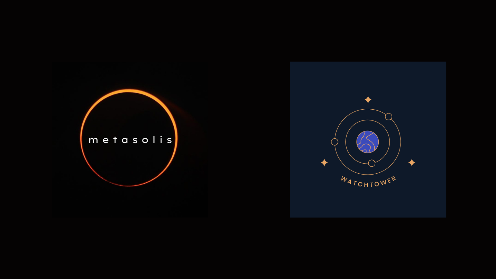

# Dora Notebook: A template notebook for Dora Tournaments

Watchtower aims to democratise the satellite tracking and risk data markets. Dora is a prediction marketplace for spacecraft collision risk. 
These are markets that use an auctions mechanism to solve the problem of dilution and state estimation to help determine collision risk of space objects 
by crowdsourcing it via data science tournaments. These tournaments use skin-in-the-game mechanics to determine risk via measuring the confidence in 
the models' performance an individual data scientist makes via bidding mechanism on their submitted models.

## Implementation Partners

This project is a collaboration of mutual interest between the [Metasolis Labs](https://metasolis.co/), and [Watchtower Foundation](https://watchtower.world/). 

Motivations:
* **Metasolis Labs:** a s.t.e.a.m studio with a focus on building open-source web3 infrastructure for space ecosystems using rigorous algorithmic mechanism design processes and tools.
* **Watchtower Foundation:** the foundation that will enable the governance of Watchtower.

 

## Contact

The above model was designed and developed by [Metasolis Labs](https://metasolis.co) commissioned by Watchtower Foundation. If you are interested supporting further development or have any other questions, reach out to us.
